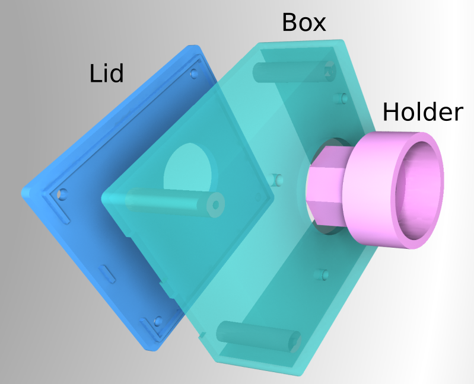
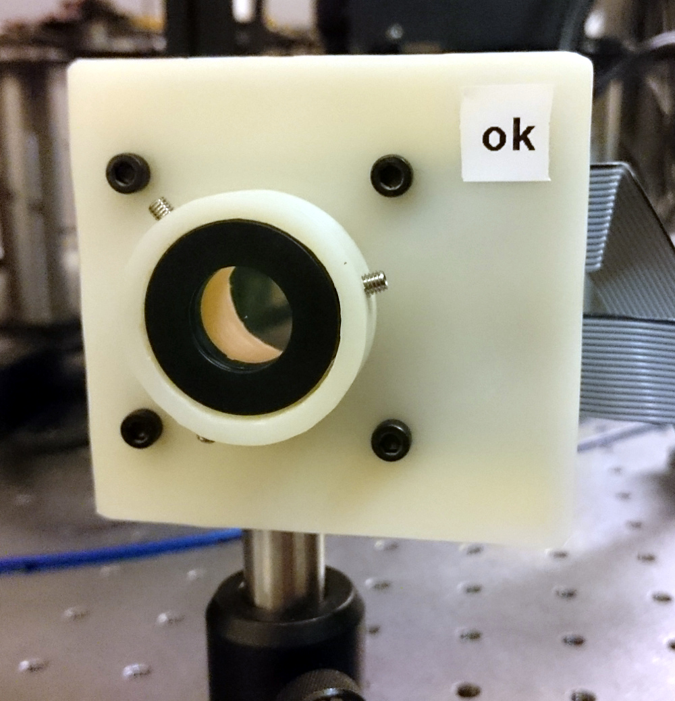

***************
Introduction
***************

ElConRoM stands for **El**\ ectronically\ **Con**\ trolled\ **Ro**\ tation\ **M**\ ount. The objective of this project was to build an easy to use, accurate, and inexpensive rotation mount for waveplates to be used in quantum tomography experiments. This has been achieved by assembling a hollow core motor from PCBMotors in a 3D printed housing. We used the 22 mm free center motor with 5760 counts per revolution. The motor is controlled with a Python library.

This manual describes in detail how to assemble the 3D printed housing and the code to control the motor.

.. _fig_render_parts:

    Rendered image of the three parts of the housing; the lid, the box, and the holder.

***********************************
Manufacturing the Motor Housing
***********************************
:numref:`fig_render_parts` shows a rendering of the three parts which from the motor housing - the lid, the box, and the waveplate holder.

To allow barrier free access to the CAD file the program FreeCAD_ has been used to design the parts.
All 3D parts were printed in PLA but the choice of material is not critical.
To build this project you will need the following tools/parts:

.. _FreeCAD: www.freecadweb.org

Tool/Part list
================================

To build the ElConRoM project the following tools/parts are necessary:

* 3D printer or printed parts
* A hollow core motor from www.PCBmotor.com (22 mm free center motor with 5760 counts per revolution)
* cutter knife
* 3 mm tap
* 2.5 mm, 3.5 mm, and a 6.5 mm drill
* three M3 set screws

The housing
=================================
The housing can be made in three easy steps:

* 3D print the lid (/CAD/Lid.stl) and the box (/Cad/Box.stl) and clean the edges with a cutter knife.
* The four stands of the box are drilled with 2.5 mm and tapped to hold M3 screws.
* A hole can be drilled in the side of the box to mount an optical post.

After all that preparation work we are ready to assemble the motor in its new housing.
The motor can be mounted easily in the box by removing its four screws and screwing long ones back in through the four holes next to the main optical opening of the box.
Then, the lid is mounted and the assembly of the housing is finished.

The waveplate holder
=============================

The waveplate holder or referred later as holder is manufactured in two steps:

* 3D print the holder (/CAD/Holder.stl) with 100% filling and clean the edges with a cutter knife.
* Make three M3 taps radially and equally spaced into the holding ring. These taps will later be used by three setscrews to hold the waveplate in place, compare :numref:`fig_housing` where two of the three setscrews are clearly visible.

The waveplate holder is mounted to the motor by a press fit. To scope with low tolerances from 3D printed parts, the holder which will be pressed into the motor is not round, but has an octagonal shape to have only eight well defined supporting points. Now we will discuss the fitting procedure to prepare the holder for mounting:

With a cutter knife the edges of the octagon are slightly conically reduced. In this way, the waveplate holder can be easily put into the motor and by a light press will hold within the motor's bearing. Care is necessary here to not overbend the springs within the motor.
:numref:`fig_housing` shows a picture of the assembled motor housing.

After the waveplate holder is mounted in the motor, the waveplate can be mounted in the holder by adjusting the three setscrews.

.. _fig_housing:

    A picture of the assembled housing. The holder is equipped with a waveplate. Two of the three setscrews are clearly visible.
